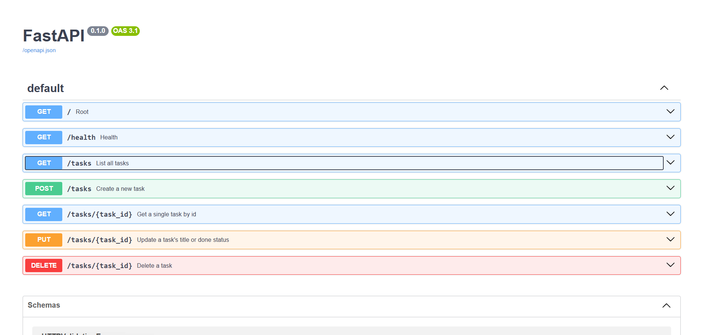

# Task API

A small CRUD API for managing a to-do list, built with FastAPI. Data is stored in memory (no database) — restarting the server resets it to the 3 example tasks.

## How to run it

```bash
git clone https://github.com/jaidevxb/todo-api.git
cd todo-api
python3 -m venv venv
venv\Scripts\activate
pip install fastapi uvicorn
uvicorn main:app --reload --port 8000
```

Then visit `http://localhost:8000` for API info, or `http://localhost:8000/docs` for interactive Swagger UI.

## Endpoints

| Method | Path          | Description                | Success | Errors   |
| ------ | ------------- | -------------------------- | ------- | -------- |
| GET    | `/`           | API info                   | 200     | —        |
| GET    | `/health`     | Health check               | 200     | —        |
| GET    | `/tasks`      | List all tasks             | 200     | —        |
| GET    | `/tasks/{id}` | Get one task               | 200     | 404      |
| POST   | `/tasks`      | Create a new task          | 201     | 400      |
| PUT    | `/tasks/{id}` | Update a task's title/done | 200     | 400, 404 |
| DELETE | `/tasks/{id}` | Delete a task              | 204     | 404      |

## Example request

```bash
curl -i -X POST http://localhost:8000/tasks -H "Content-Type: application/json" -d "{\"title\":\"Buy milk\"}"
```

Response:
HTTP/1.1 201 Created
content-type: application/json
{"id":4,"title":"Buy milk","done":false}

## Swagger UI



## Notes

Data is stored in memory only — all tasks reset to the original 3 example tasks every time the server restarts. Persistent storage (a database) is planned for a future stage.
