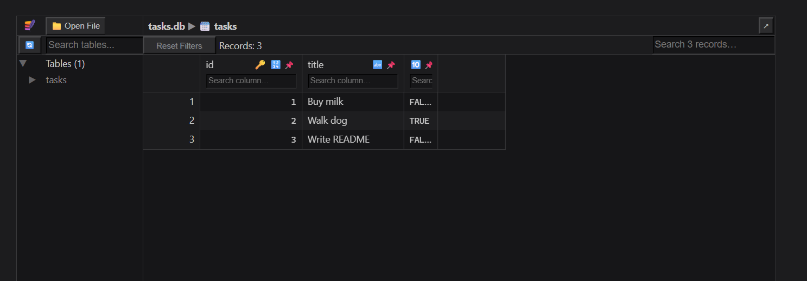
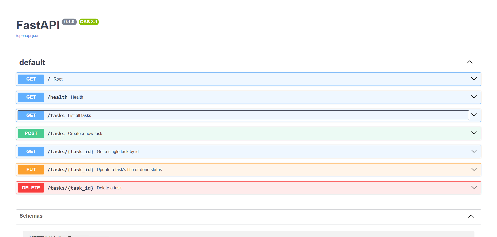

# Task API

A small CRUD API for managing a to-do list, built with FastAPI. Tasks are stored in a
SQLite database, so data survives a server restart.

## Why SQLite

- **No server to install or run.** The whole database is one file. Cloning the repo and
  running the app is all it takes — there is no separate database process to start, no
  connection string to configure, and no credentials to manage.
- **It ships with Python.** The `sqlite3` module is in the standard library, so the
  dependency list stays at FastAPI and uvicorn.
- **It is real SQL.** The same `SELECT` / `INSERT` / `UPDATE` / `DELETE` statements used
  here work against PostgreSQL or MySQL later. Only the connection code would change.

The trade-off is that SQLite is a single file on one machine, so it does not suit an app
that needs many servers writing at once. For a single-process to-do API it is a good fit.

## Where the database lives

`tasks.db`, in the project root, next to `main.py`.

The file is **not** committed — it is listed in `.gitignore`. It does not need to be,
because the app creates everything it needs on startup:

1. `init_db()` runs when the server starts (via FastAPI's `lifespan` hook).
2. `CREATE TABLE IF NOT EXISTS tasks (...)` creates the table if it is missing.
3. If the table has zero rows, three example tasks are inserted.

Step 3 is guarded by a row count, so the examples appear on the **first** run only.
Restarting the server does not duplicate them. (If you empty the table by hand, the next
start will seed it again — the check is "is it empty", not "has it ever been seeded".)

The schema:

| Column  | Type      | Notes                              |
| ------- | --------- | ---------------------------------- |
| `id`    | `INTEGER` | Primary key, assigned by SQLite    |
| `title` | `TEXT`    | Not null                           |
| `done`  | `BOOLEAN` | Stored as `0`/`1`, defaults to `0` |

SQLite has no true boolean type, so `done` is stored as `0` or `1` and converted back to
JSON `true`/`false` before the API responds.

## How to run it

```bash
git clone https://github.com/jaidevxb/todo-api.git
cd todo-api
python -m venv venv
venv\Scripts\activate
pip install fastapi uvicorn
uvicorn main:app --reload --port 8000
```

The first start creates `tasks.db` automatically. Then visit `http://localhost:8000` for
API info, or `http://localhost:8000/docs` for the interactive Swagger UI.

## Endpoints

| Method | Path          | Description                | Success | Errors   |
| ------ | ------------- | -------------------------- | ------- | -------- |
| GET    | `/`           | API info                   | 200     | —        |
| GET    | `/health`     | Health check               | 200     | —        |
| GET    | `/tasks`      | List all tasks             | 200     | —        |
| GET    | `/tasks/{id}` | Get one task               | 200     | 404      |
| POST   | `/tasks`      | Create a new task          | 201     | 400      |
| PUT    | `/tasks/{id}` | Update a task's title/done | 200     | 400, 404 |
| DELETE | `/tasks/{id}` | Delete a task              | 204     | 404      |

These are unchanged from the in-memory version. The URLs, request bodies, and responses
are all identical — only the storage layer was swapped.

## Example request

```bash
curl -i -X POST http://localhost:8000/tasks -H "Content-Type: application/json" -d "{\"title\":\"Buy milk\"}"
```

Response:

```
HTTP/1.1 201 Created
content-type: application/json

{"id":4,"title":"Buy milk","done":false}
```

Restart the server and `GET /tasks` still returns it.

## Example SQL

Run against `tasks.db` with any SQLite client:

```sql
SELECT * FROM tasks WHERE done = 1;
```

```
(2, 'Walk dog', 1)
```

More queries, with their output and what they demonstrate, are in
[sql-notes.md](sql-notes.md).

## Database viewer



## Swagger UI


